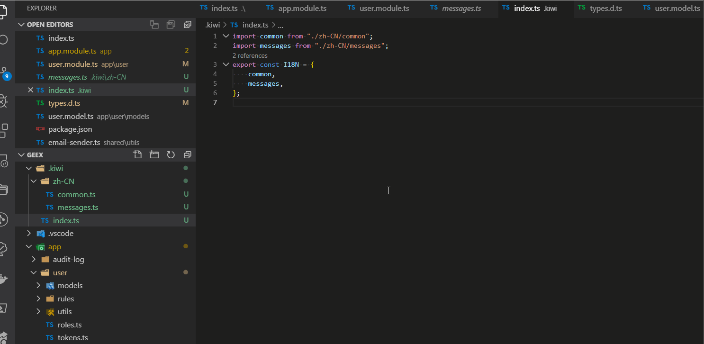

# 🐤 kiwi linter

kiwi 的 `VS Code`插件工具，主要用于检测代码中的中文，高亮出中文字符串，并一键提取中文字符串到对应的语言 Key 库。

同时优化开发体验，在 `VS Code` 中提供搜索中文，提示国际化值对应的中文功能。

## 如何使用

> VS Code 插件搜索 kiwi linter 安装

> 推荐与[🐤 Kiwi-国际化全流程解决方案](https://github.com/alibaba/kiwi)结合使用

## 配置项

### vscode-i18n-linter.langPrefix

default: `.kiwi/zh-CN/`

多语言文件的位置, kiwi linter将根据目录内的多语言文件提取对应语言(默认为中文`zh-CN`)高亮.
可以参考的目录结构如下:

### vscode-i18n-linter.i18nFilesPattern

default: `**/src/**/ts*`

待扫描的文件类型，可以基于 [minimatch](https://github.com/isaacs/minimatch) 规则进行自定义。

### vscode-i18n-linter.markStringLiterals

default: `true`

是否标红中文字符串，默认开启。

### vscode-i18n-linter.showOverviewRuler

default: `true`

右侧滚动条中，是否显示对应的待提取中文高亮。

### vscode-i18n-linter.markColor

default: `#ff4400`

待提取文字，高亮颜色。

### vscode-i18n-linter.enableReplaceSuggestion

default: `true`

是否开启一键提取中文功能。

## VS code 命令

### 在全部代码库中查找国际化文案
默认快捷键是 `cmd + ctrl + r`.
同时也提供状态栏按钮 `Kiwi Search`，点击触发全局搜索.

### 在当前文件中查找国际化文案
默认快捷键是 `cmd + ctrl + f`.

## Changelog
### 1.3.9

-  处理了部分特殊字符制表符的检测
### 1.3.8

-  添加vue模板语法替换 优化模板语法中的函数等包含的中文处理`{name==1?'吃':'去'}`

### 1.1.4

-  优化国际化文案提示

### 1.1.2

- 支持 HTML 文件

### 1.0.0

- 支持国际化 Key 值显示
- 支持对应国际化文案的搜索
